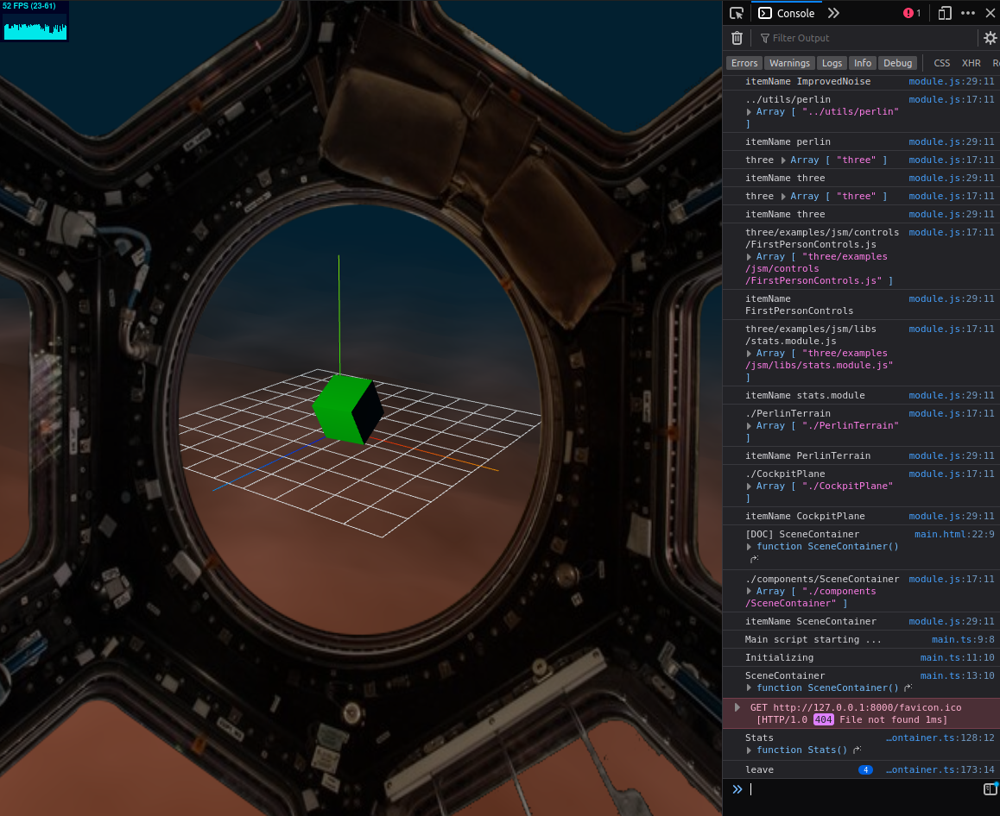

# floatsim

Approach to make a walkable/floatable simulation.

First approach to build a terrain with Perlin noise.


Then adding a cockpit (just a texture to start :)


Tweaking the fog colors when changing depth. Adding a depth display.


Adding more HUD fragments: Depth meter and compass.


## Build THREE examples

```bash
npm run rollup-browser-umd
```

## Build for Testing

```bash
npm run compile-typescript
```

## Build for dist

CURRENTLY NOT WORKING, NEEDS TO BE FIXED

## Todos & ideas

- [DONE] Add basic scene setup.
- [DONE] Add simple terrain generation.
- Get class inheritance running.
- Get webpack back running (somehow the main.js script is falsy overwritten when packing).
- Build collision detection with terrain.
- Add dummy ship as simple composite object.
- [DONE] Build first person view.
- [DONE] Build controls (forward, backward, up, down, left, right).
- Add damping to the controls.
- Add a non-terrain object (a building or so).
- Build collision detection with non-terrain objects.
- [DONE] Add FPS stats.
- Limit upper depth at 0 (or less). Vessel must never go over zero (which would be above the sea level).
- Build a caustics animation/shader for the ocean floor.
- [DONE] Change water color depending of depth.
- [DONE] Add cockpit (image).
- Add cockpit (mesh?).
- Make fancy scene blending effect (like in Archimedean Dynasty cutscenes).
- Add floating particles (sprites?).
- Add ambient sound (liiek water bubbling/streaming).
- Add collision sounds. Each "material" should have its own sound (sand, metal, stone, organic?).
- [DONE] Add a depth measure (to the ground and to the surface). Add a "pressure" HUD.
- Add a system alarm to warn for "radiation" and "high pressure".
- Add add compass HUD. (use OrbitControls.getAzimuthalAngle() ?)
- Add water plants.
- Add a sonar HUD.
- [DONE] Let initial settings being passed by GET parameters.
- Tinker with THREE VolumetricLight.
- Fog Color must be passed to the new terrain shader on each position change.
- Add a custom camera/scene for separate cockpit rendering.
- Create simple logo and favicon?
- Add target HUD like CubeIconBox (https://hofk.de/main/discourse.threejs/2019/CubeBoxIcon/CubeBoxIcon.html)
- Make hudData a globally available object?
- HudComponent: buffer color style string in class variable (is rarely changed)
- Compass: load compass texture from SVG?
- Add floating particles (sprites?).
- Bounds2Immutable: try function overloading with the new Typescript here (constructor).

## Credits

- Ken Perlin for the improved Perlin noise https://cs.nyu.edu/~perlin/noise/
- jaamo for the HUD howto (https://codepen.io/sjcobb/pen/XWjMdXb)
- Three JS Custom Shader Material and fog hack: https://snayss.medium.com/three-js-fog-hacks-fc0b42f63386
- Underwater ambience sound https://pixabay.com/sound-effects/underwater-ambiencewav-14428/
- Cocopon for Tweakpane https://cocopon.github.io/tweakpane
- Vector Ruler Generator by robbbb https://robbbb.github.io/VectorRuler/
